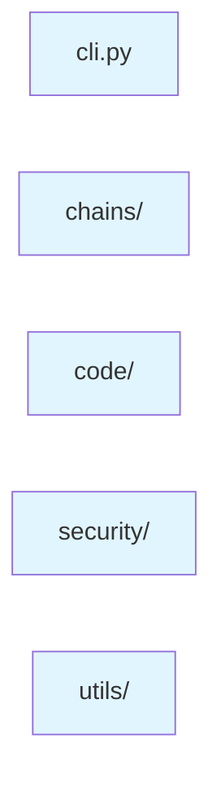

# Token Query Tool - 项目文档

## 项目简介

Token Query Tool 是一个支持多链代币查询和安全扫描的命令行工具，支持 Ethereum、BSC、Polygon、Arbitrum、Optimism、Avalanche、Sui 和 Solana 等多种区块链。

## 核心功能

- **代币信息查询**：查询代币基本信息（名称、符号、供应量等）
- **合约代码获取**：无需 API key，直接从网页或 RPC 获取合约源代码
- **安全扫描**：模式匹配扫描 + GoPlus Labs 安全信息
- **LLM 提示词生成**：收集所有信息并生成专业的审计报告提示词

## 项目结构



## 功能模块

### 命令行接口 (cli.py)
- 参数解析和命令分发
- 输出格式化
- 主要功能：
  - 查询代币信息
  - 导出代码压缩包
  - 执行安全扫描
  - 生成 LLM 提示词

### 链查询模块 (chains/)
- **evm.py**: 查询 EVM 链代币信息
- **solana.py**: 查询 Solana 链代币信息
- **sui.py**: 查询 Sui 链代币信息

### 代码获取模块 (code/)
- **evm_code.py**: 从网页爬取 EVM 合约源代码
- **solana_code.py**: 获取 Solana 程序字节码
- **sui_code.py**: 获取 Sui Move 源代码

### 安全扫描模块 (security/)
- **pattern_scanner.py**: EVM 合约模式匹配扫描（20+ 规则）
- **sui_scanner.py**: Sui Move 代码扫描（15+ 规则）
- **goplus_scanner.py**: GoPlus Labs 安全信息查询

### 工具模块 (utils/)
- **detection.py**: 链类型自动检测
- **formatters.py**: 输出格式化

## 数据流

```
用户输入 → 命令行接口 → 功能模块 → 输出结果
```

## 使用示例

### 查询代币信息
```bash
python3 main.py --info 0xdAC17F958D2ee523a2206206994597C13D831ec7
```

### 获取合约代码
```bash
python3 main.py --code 0xdAC17F958D2ee523a2206206994597C13D831ec7
```

### 安全扫描
```bash
python3 main.py --scan 0xdAC17F958D2ee523a2206206994597C13D831ec7
```

### 生成LLM提示词
```bash
python3 main.py --llm 0xdAC17F958D2ee523a2206206994597C13D831ec7
```

## 支持的链

```
支持的链
├── EVM链
│   ├── Ethereum
│   ├── BSC
│   ├── Polygon
│   ├── Arbitrum
│   ├── Optimism
│   └── Avalanche
└── 其他链
    ├── Sui
    └── Solana
```

## 安全扫描规则

### EVM 扫描器（20+ 规则）
- 重入攻击、访问控制、整数溢出、未检查调用、时间戳依赖、delegatecall、硬编码密钥、无界循环等

### Sui Move 扫描器（15+ 规则）
- init函数检查、访问控制、转账权限、可增发检测、暂停权限、硬编码密钥、资源管理等

## 项目统计

- 总文件数: 27
- 代码行数: 8000+
- 支持链数: 8
- 扫描规则数: 35+

## 安装

```bash
pip install -r requirements.txt
```

## 许可证

MIT 许可证

## 项目地址

https://github.com/SilenceDiors/token-query-tool

---

*最后更新: 2025-11-18*
